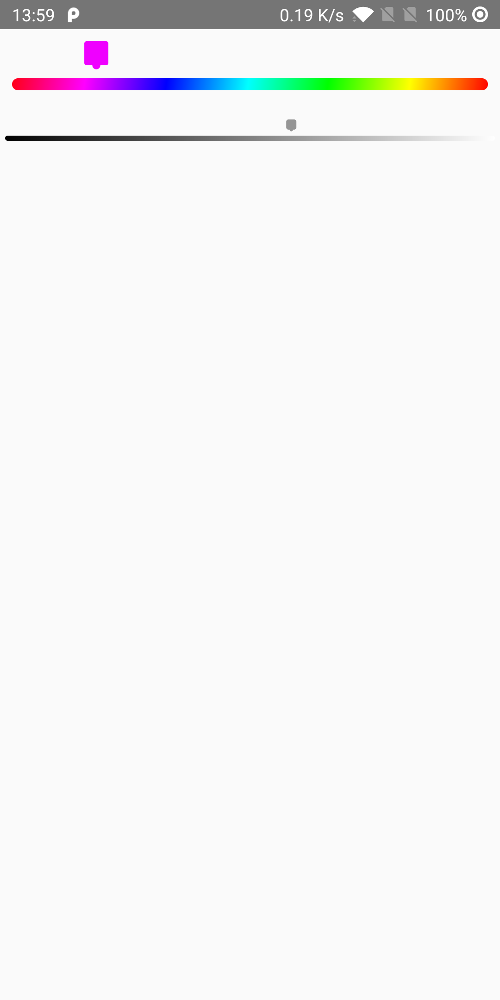

# ColorBar
ColorBar

根据https://github.com/lannaican/ColorBar这位大胸弟的控件改的 。大家谢谢他


<p align="center">
	
	<p align="center">
		<em>图片示例</em>
	</p>
</p>


> 1.使用
```java
<com.star.view.colorbar.ColorBar
        android:id="@+id/colorBar"
        android:layout_width="match_parent"
        android:layout_height="60dp"/>

    <com.star.view.colorbar.ColorValueBar
        android:id="@+id/colorValueBar"
        android:layout_width="match_parent"
        android:layout_height="26dp"
        android:layout_marginTop="10dp"/>

colorBar.setThumbColor(int);
colorBar.setThumbBorderColor(int);
colorBar.setThumbBorderWidth(float);
colorBar.setValueBar(ColorValueBar)
colorBar.setColor(int);
colorBar.addOnColorChangedListener(listener);
colorValueBar.addOnColorChangedListener(listener);
//最终颜色使用colorBar.getValueBar()或者colorValueBar.getColor()
```
